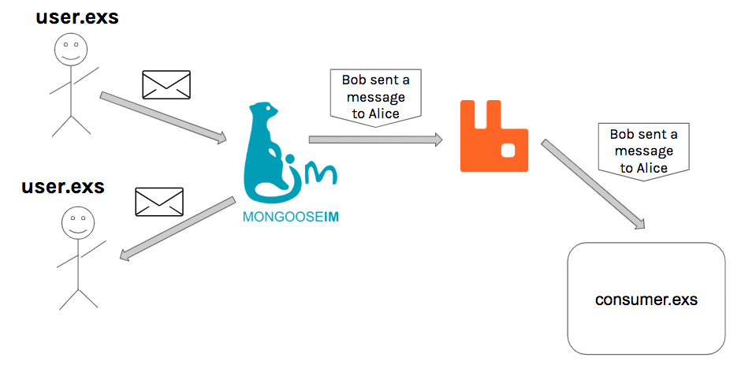

# MongooseIM with RabbitMQ demo

The aim of this repository is to present an example scenario when MongooseIM
pushes events to RabbitMQ. The scenario takes advantage of a feature described
here: https://github.com/esl/MongooseIM/pull/2127.

## System architecture

The image below shows the system architecture:




One user sends a message to the other through MongooseIM (using
[`user.exs`](endpoints/lib/user.exs) script). When the message flows through
MongooseIM appropriate events are generated and pushed to RabbitMQ. Events are
then consumed (by [`consumer.exs`](endpoints/lib/consumer.exs) script).

## Step-by-step guide

### Requirements

* docker
* docker-compose
* makefile
* elixir 1.6

### Running the demo

1. Set up the environment

  ```bash
  make
  ```

2. Run the consumer

  ```bash
  make consumer
  ```

3. Run two users (run the following command twice in different consoles). 
  ```bash
  make user
  #Are you Bob or Alice? (type `b` or `a`): b
  ```
  
  > PROTIP: Choose different roles for the users. You'll be asked by the script if
  > you play as `Alice` or `Bob`.

